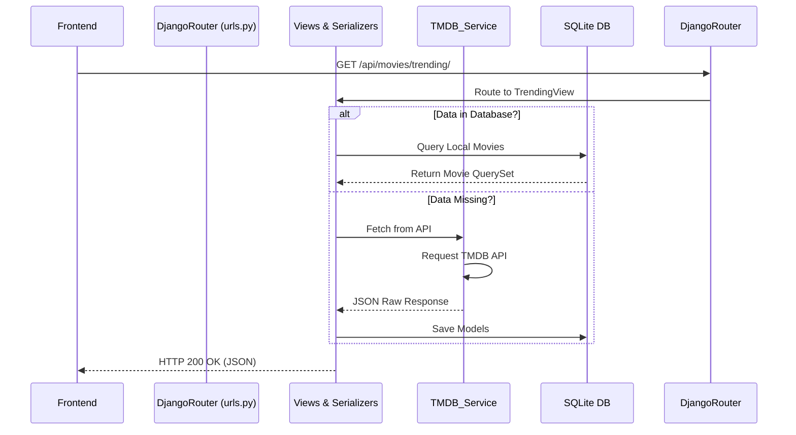

# CineQuest Backend: Django REST API

Welcome to the CineQuest backend repository. This application serves as the core data and authentication layer for the CineQuest movie discovery platform, providing JSON endpoints for the Next.js frontend and acting as a synchronization bridge to the external TMDB API.

---

## 🛠 Prerequisites

Before starting, ensure you have the following installed on your machine:
* **Python** (v3.10 or higher)
* **pip** (Python package manager)
* **SQLite** (Default) or **PostgreSQL** (Production ready)
* Optionally: **Redis** (if caching is enabled via the environment)

---

## 🚀 Local Setup & Installation (First Attempt)

1. **Check out your Feature Branch**  
   Never work on `main`. Find your branch in `PROJECT_GUIDE.md`.
   ```bash
   git checkout <your-assigned-branch>
   ```

2. **Create a Virtual Environment**  
   It natively isolates the project's dependencies from your global Python environment.
   ```bash
   cd backend
   python -m venv venv
   source venv/bin/activate       # On Mac/Linux
   venv\Scripts\activate          # On Windows
   ```

3. **Install Dependencies**  
   ```bash
   pip install -r requirements.txt
   ```

4. **Configure Environment Variables (.env)**  
   Create a file named `.env` in the `backend/` folder. Populate it with the keys below. **Do not share your .env on GitHub.**
   ```env
   TMDB_API_KEY=your_tmdb_api_key_v3_here
   DJANGO_SECRET_KEY=super-secret-local-key
   DEBUG=True
   ALLOWED_HOSTS=localhost,127.0.0.1
   CORS_ORIGINS=http://localhost:3000,http://127.0.0.1:3000
   ```

5. **Run Database Migrations**  
   This creates your `db.sqlite3` file and tables.
   ```bash
   python manage.py migrate
   ```

6. **Seed the Local Database (TMDB Sync)**  
   *Note: Must be run in this order.*
   ```bash
   python manage.py sync_movies --genres
   python manage.py sync_movies --trending 2
   ```

7. **Start the Development Server**  
   ```bash
   python manage.py runserver
   ```
   The API will now be available at `http://127.0.0.1:8000/`.

---

## 🏗 Architecture & System Breakdown

The Django configuration utilizes a micro-app structure to separate concerns:

| App Name | Primary Responsibility |
| :--- | :--- |
| **`cinequest`** | Core router, `settings.py` (CORS, auth settings), environment loader. |
| **`movies`** | `Movie` schemas, trending fetching, TMDB integration services, and DRF ViewSets. |
| **`users`** | Custom `User` models built for JWT Authentication via `SimpleJWT`. |
| **`recommendations`** | Algorithms and data models mapping user watchlists to movie similarity vectors. |

### File Structure Map
```text
backend/
├── cinequest/            # Core settings and URL router
│   ├── settings.py       # <--- Environment and App definitions
│   └── urls.py           # <--- Main routing
├── manage.py             # Django entry terminal script
├── movies/               # Core Movie App
│   ├── management/       # Script jobs
│   │   └── commands/sync_movies.py # <--- Task to populate Database from TMDB
│   ├── models.py         # DB Schemas
│   ├── serializers.py    # JSON data mapping
│   ├── services/
│   │   └── tmdb_service.py # <--- External HTTP wrapper for TMDB
│   ├── urls.py           # Movie endpoints
│   └── views.py          # Route controllers
├── recommendations/      # Recommender Engine App
│   ├── models.py
│   ├── serializers.py
│   ├── services/engine.py
│   └── views.py
├── requirements.txt      # Python dependencies
└── users/                # Authentication App
    ├── models.py
    ├── urls.py
    └── views.py          # Session and user generation
```

### Data Flow Diagram



---

## 🧪 Testing Protocol

Testing is mandatory for our final exam grade. We require a minimum of 5 backend unit tests.

**To Run Tests:**
```bash
python manage.py test
# OR if pytest is configured later:
pytest
```

**What you should be testing:**
- Do models save correctly with valid data?
- Does `GET /movies/` require auth, or is it public?
- Does the TMDB sync script throw errors if the API key is invalid?

---

## 🚨 Troubleshooting & Common Issues

- **`ModuleNotFoundError: No module named 'movie'`**: Check if `"movie.apps.MoviesConfig"` is in `settings.py` `INSTALLED_APPS` instead of `"movies"`.
- **CORS Preflight Fails**: Ensure `corsheaders.middleware.CorsMiddleware` exists in the `MIDDLEWARE` array of `settings.py`, and `CORS_ORIGINS` in your `.env` exactly matches the Next.js port.
- **Empty Database/Data Mismatch**: Ensure you ran `sync_movies --genres` *before* fetching trending movies, otherwise ForeignKey constraints for genres will crash.
