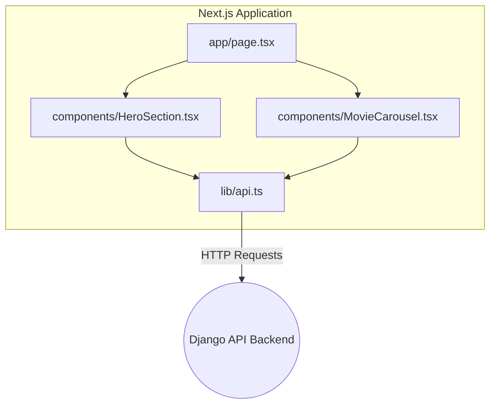

# CineQuest Frontend: Next.js Web App

Welcome to the CineQuest frontend client. This application uses the modern Next.js 14 App Router, providing a highly responsive, server-rendered React user interface mapped to our external Django backend.

---

## 🛠 Prerequisites

Ensure you have the following installed before development:
* **Node.js** (v18.17.0 or higher)
* **npm** (v9+ via Node) or **yarn** / **pnpm**
* A running instance of the **CineQuest Django Backend** (on `localhost:8000`) to provide data.

---

## 🚀 Local Setup & Installation (First Attempt)

1. **Check out your Feature Branch**  
   Never work on `main`. Find your branch in `PROJECT_GUIDE.md`.
   ```bash
   git checkout <your-assigned-branch>
   ```

2. **Install Dependencies**  
   Navigate to the frontend folder and install all NPM packages.
   ```bash
   cd frontend
   npm install
   ```

3. **Configure Environment Variables (.env.local)**  
   Create a file named `.env.local` in the `frontend/` folder.
   ```env
   # Ensure this points to the exact URL of your local Django server
   NEXT_PUBLIC_API_URL=http://localhost:8000/api
   ```

4. **Start the Development Server**  
   ```bash
   npm run dev
   ```
   The application will boot on `http://localhost:3000/`.

---

## 📜 Available Scripts

| Command | Action |
| :--- | :--- |
| `npm run dev` | Starts the local Next.js development server with Hot-Module-Reloading. |
| `npm run build` | Compiles the application into static files and optimized server bundles. |
| `npm start` | Runs the production build generated from `npm run build`. |
| `npm run lint` | Runs ESLint to catch TypeScript or React syntax/rule violations. |

---

## 🏗 Architecture & File Structure

Our codebase enforces a strict separation of UI components, server layouts, and API logic. 

- **`src/app/`**: Next.js App Router topology. Every folder here maps to a browser URL (e.g., `/search`, `/movie/[id]`). 
- **`src/components/`**: Pure UI/React components. Try to keep them as "dumb" as possible (accepting props, returning JSX) unless they explicitly require `use client` hooks.
- **`src/lib/`**: Context Providers (for Auth) and core API clients (`lib/api.ts` wrapping Axios/Fetch).
- **`src/types/`**: The backbone of the strict typing. Use these interfaces in API responses.

### File Structure Map
```text
frontend/
├── next.config.js          # Next.js configurations
├── package.json            # Node.js dependencies
├── public/                 # Static assets (fonts, svgs, placeholder images)
├── src/
│   ├── app/                # The Next.js App Router (each folder is a route)
│   │   ├── compare/        # Compare route (/compare)
│   │   ├── dashboard/      # Profile route (/dashboard)
│   │   ├── genre/          # Genre lists (/genre)
│   │   ├── movie/          # Single movie view (/movie/[id])
│   │   ├── search/         # Active search route (/search)
│   │   ├── globals.css     # Global Base CSS + Tailwind Directives
│   │   ├── layout.tsx      # Application Shell (Wraps around every page.tsx)
│   │   └── page.tsx        # Homepage (HeroSection + Carousels)
│   ├── components/         # Reusable UI Blocks
│   │   ├── AuthModal.tsx
│   │   ├── Footer.tsx
│   │   ├── MovieCard.tsx   # <--- The individual mapped movie poster
│   │   ├── Navbar.tsx
│   │   └── SearchModal.tsx
│   ├── lib/                # API Logic and State Contexts
│   │   ├── AuthContext.tsx # User login hook
│   │   └── api.ts          # Core Axios/Fetch wrappers for Backend calls
│   └── types/              # TypeScript Definitions
│       └── movie.ts        # <--- Missing types must be added here
└── tailwind.config.js      # CSS variables and breakpoints
```

### Component Flow Architecture



---

## 🧪 Testing Protocol

The exam rubric mandates a minimum of 3 frontend component tests. Ensure any new logic is verified.

*Note: Since standard testing tools might not be configured out of the box in this repository, the Testing Lead will need to wire up `Jest` and `@testing-library/react` inside this folder.*

When writing tests:
1. Target isolated visual components first (e.g. `MovieCard.tsx`).
2. Test prop outputs accurately.
3. Test that inputs in `SearchModal.tsx` trigger the correct state changes.

---

## 🚨 Troubleshooting & Development Rules

- **Client vs Server Components**: By default, Next.js 14 pages are Server Components. If you need `useState`, `useEffect`, or `onClick`, you MUST place `"use client";` at the very top of the `.tsx` file.
- **The Pagination Object Trap**: The Django backend returns `{ count: X, next: Y, results: [...] }`. If your Map function crashes, you are passing `response.data` instead of `response.data.results`.
- **TypeScript `any` rule**: Grading expects strict types. Never use `any`. Define an interface in `src/types/` and apply it.
